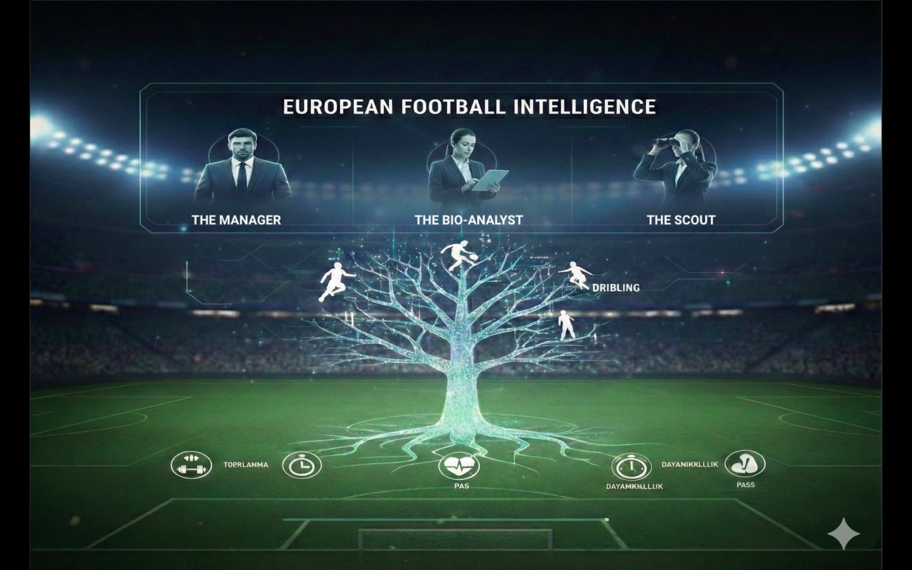
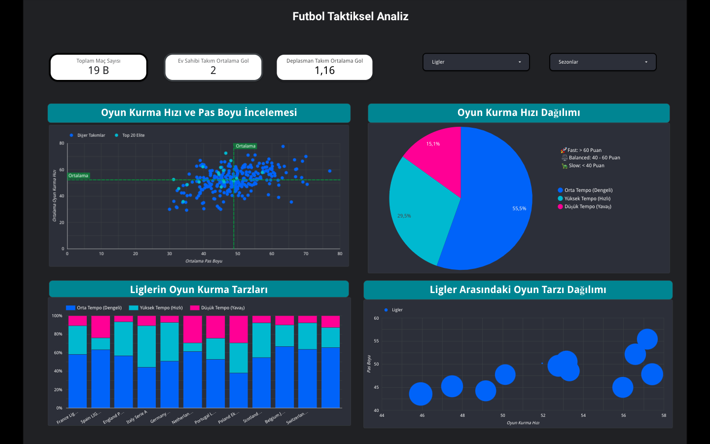
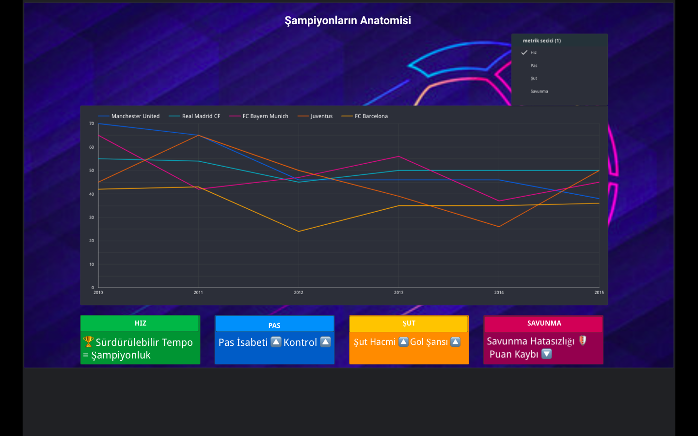
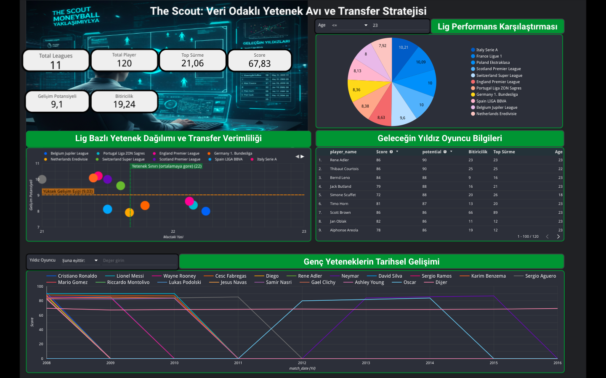
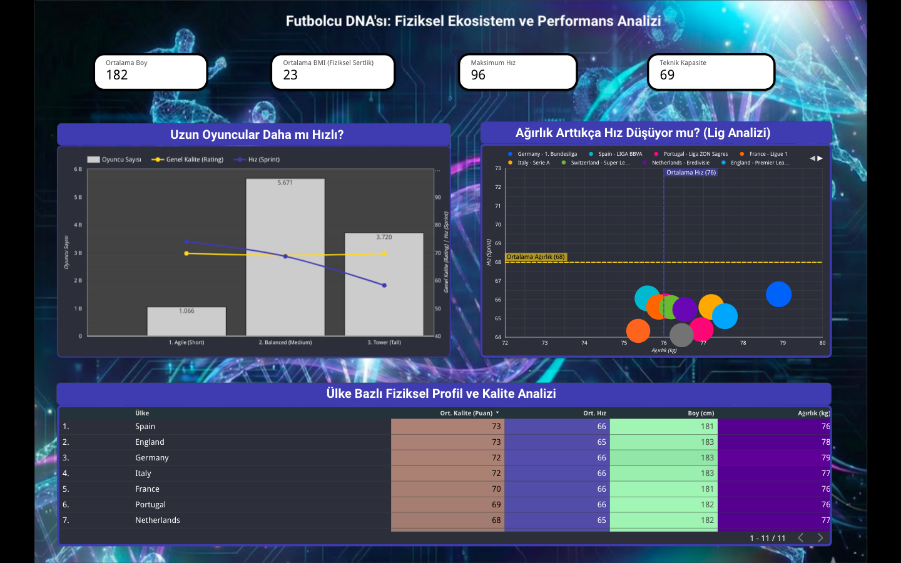
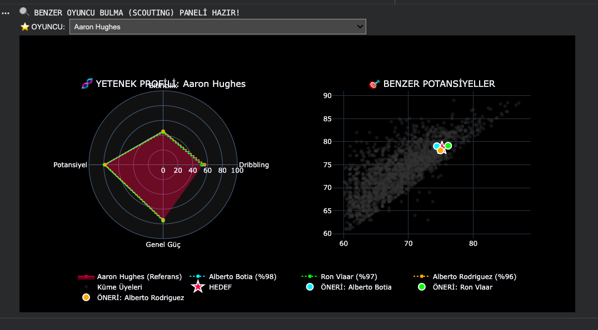
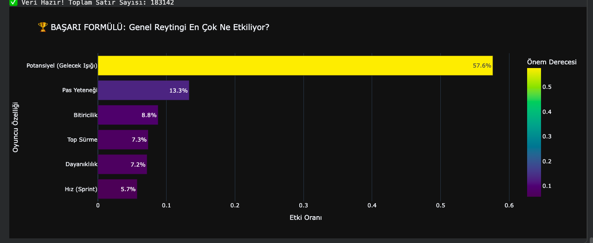
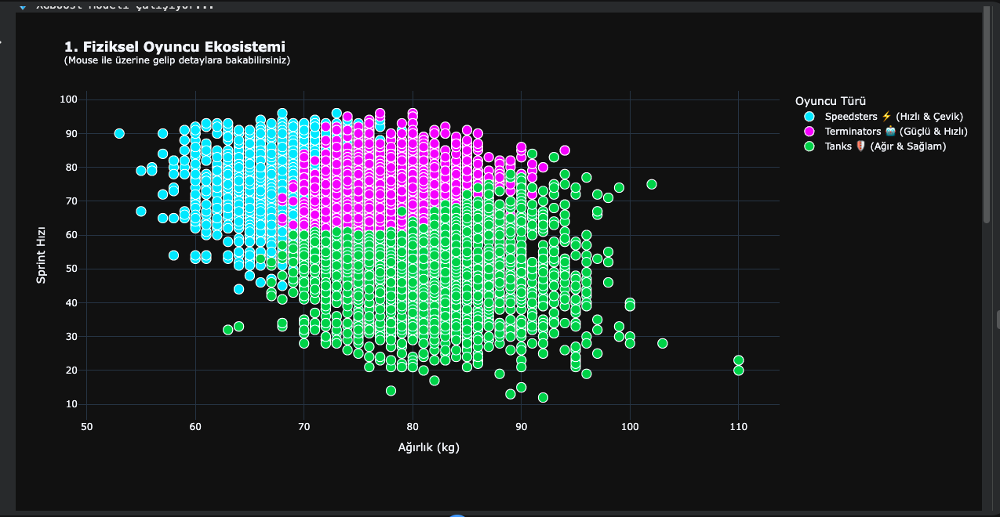
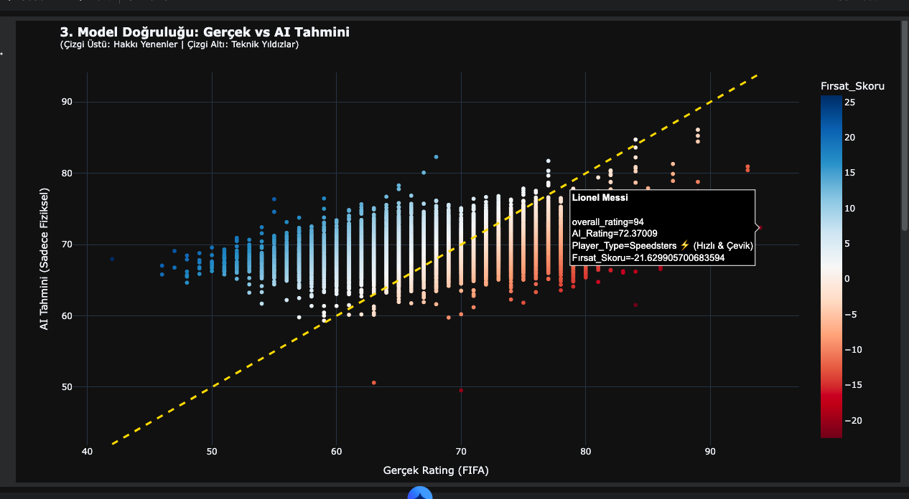
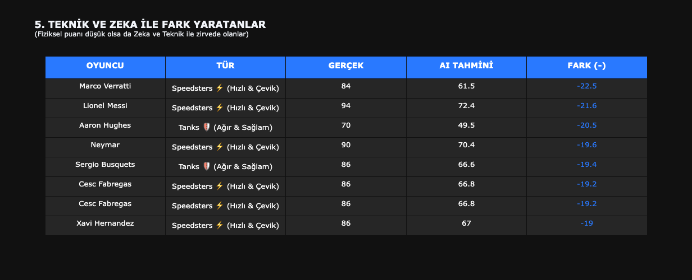

# European Football Intelligence
**Football analytics + ML dashboards for scouting and performance insights.**

This project combines interactive dashboards and a machine learning notebook to explore:
- Tactical style differences across European leagues
- Player archetypes and physical profiles
- Scouting support (similar-player search + radar profiles)
- Model-driven insights (feature importance, actual vs. AI prediction gaps)

---

## Project Highlights
- **League tactical analysis**: build-up speed, passing patterns, and style distribution  
- **Scouting dashboard**: player radar + similar players panel  
- **ML insights**: feature importance (“success formula”), prediction error analysis, and top discrepancies  
- **Clean, portfolio-ready visuals** exported from the dashboards

---

## Visual Overview

### Cover

### Dashboards
**Tactical Analysis**

**Champions Anatomy**

**The Scout**

**Player DNA**

**Scouting Panel (Radar + Similar Players)**

---

## Machine Learning Outputs
**Feature Importance (Success Formula)**

**Player Archetypes: Sprint vs Weight**

**Actual vs AI Prediction**

**Top Discrepancies Table**

---

## Repository Contents
- `European Football.ipynb` — end-to-end analysis + ML experiments
- Dashboard exports (`.png`) — portfolio visuals used in the README

---

## How to Run
1. Clone the repo
2. Open `European Football.ipynb` in Jupyter / Colab
3. Install requirements (if needed):  
   - `pandas`, `numpy`, `matplotlib`, `scikit-learn`, `xgboost` (optional)

---

## Notes
- Dataset: *(add Kaggle/source link here if you want)*  
- This repository is intended for portfolio/demo purposes.

---

## Author
Selen İmahanoğlu
Begüm Yapıcıoğlu
Erdinç Uyar
